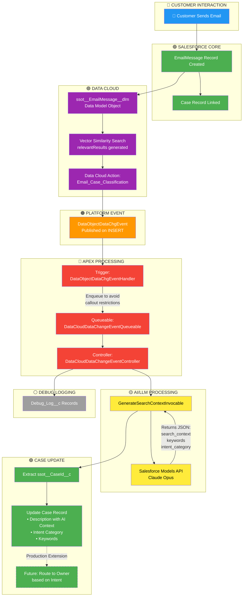
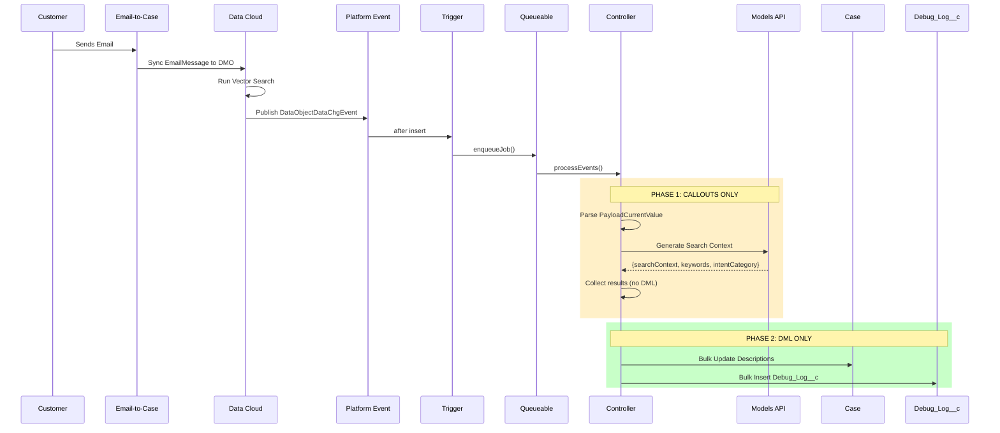

# Email Case Classification - Business Logic Flow

## Overview

This document describes the automated email-to-case classification system that leverages **Salesforce Data Cloud**, **Platform Events**, and **AI/LLM** to intelligently classify incoming customer emails and update the associated Case records.

---

## Architecture Diagram



---

## Color Legend

| Color | Component Type | Description |
|-------|---------------|-------------|
| 🔵 **Blue** | Customer Interaction | External customer touchpoint |
| 🟢 **Green** | Salesforce Core / Output | Standard Salesforce objects and final Case updates |
| 🟣 **Purple** | Data Cloud | Data Model Objects, Vector Search, Data Actions |
| 🟠 **Orange** | Platform Events | Asynchronous event-driven messaging |
| 🔴 **Red** | Apex Processing | Trigger, Queueable, and Controller logic |
| 🟡 **Yellow** | AI/LLM | Intelligent context generation using Models API |
| ⚪ **Gray** | Logging | Debug and audit trail |

---

## Component Details

### 1. Trigger Layer
**File:** `DataObjectDataChgEventHandler.trigger`

```apex
trigger DataObjectDataChgEventHandler on DataObjectDataChgEvent (after insert) {
    System.enqueueJob(new DataCloudDataChangeEventQueueable(Trigger.new));
}
```

- Listens for `DataObjectDataChgEvent` platform events
- Immediately enqueues processing to avoid callout restrictions in trigger context

---

### 2. Queueable Layer
**File:** `DataCloudDataChangeEventQueueable.cls`

- Implements `Queueable` and `Database.AllowsCallouts`
- Enables HTTP callouts (required for LLM API calls)
- Delegates to controller for actual processing

---

### 3. Controller Layer
**File:** `DataCloudDataChangeEventController.cls`

**Responsibilities:**
1. **Extract Event Metadata:** EventType, EventUuid, ActionDeveloperName, etc.
2. **Parse Payload:** Deserialize `PayloadCurrentValue` JSON
3. **Extract Case Link:** Get `ssot__CaseId__c` for Case update
4. **Call LLM Service:** Generate search context, keywords, and intent category
5. **Update Case Record:** Append AI-generated context to Case description
6. **Debug Logging:** Create `Debug_Log__c` records for audit trail

---

### 4. LLM Invocable
**File:** `GenerateSearchContextInvocable.cls`

**Input Fields:**
| Field | Source from Payload |
|-------|---------------------|
| `caseSubject` | `ssot__Subject__c` |
| `caseDescription` | `ssot__EmailMessageText__c` |
| `caseName` | `ssot__Name__c` |
| `caseComments` | Derived from metadata hints |

**Output Fields:**
| Field | Description |
|-------|-------------|
| `searchContext` | Semantic search-optimized paragraph (2-4 sentences) |
| `keywords` | 5-10 high-value search keywords |
| `intentCategory` | One of: TROUBLESHOOTING, HOW_TO, BILLING, ACCOUNT, FEATURE_REQUEST, GENERAL_INQUIRY, COMPLAINT, INTEGRATION |

---

## Data Cloud Payload Structure

### Key Fields in PayloadCurrentValue

```json
{
  "ssot__CaseId__c": "500al00000mfMVZAA2",       // ← Case to update
  "ssot__Subject__c": "Smart Thermostat...",     // ← Email subject
  "ssot__EmailMessageText__c": "Hello, I...",    // ← Email body
  "ssot__Name__c": "Smart Thermostat...",        // ← Name field
  "ssot__FromAddress__c": "customer@email.com",  // ← Sender
  "ssot__DataSourceObjectId__c": "EmailMessage", // ← Source object type
  "relevantResults": [...]                       // ← Vector search results from Data Cloud
}
```

### Event Metadata

```json
{
  "EventType": "CDCEvent",
  "EventPrompt": "INSERT",
  "ActionDeveloperName": "Email_Case_Classification",
  "SourceObjectDeveloperName": "ssot__EmailMessage__dlm"
}
```

---

## Case Update Logic (Demo)

The system updates the Case record with AI-generated context:

```
┌─────────────────────────────────────────────────────────────────┐
│ CASE: 500al00000mfMVZAA2                                        │
├─────────────────────────────────────────────────────────────────┤
│ Description (Updated):                                          │
│ ─────────────────────────────────────────────────────────────── │
│ [Original Description]                                          │
│                                                                 │
│ ═══════════════════════════════════════════════════════════════ │
│ AI CLASSIFICATION (2026-02-10T21:27:43Z)                        │
│ ─────────────────────────────────────────────────────────────── │
│ Intent Category: TROUBLESHOOTING                                │
│ Keywords: smart thermostat, model 89008x, unresponsive,         │
│           Wi-Fi connection, device offline, frozen screen       │
│ Search Context: Customer reports smart thermostat Model #89008x │
│                 became unresponsive after one month of use.     │
│                 Device shows frozen screen, won't connect to    │
│                 Wi-Fi, and app displays "device offline" error. │
└─────────────────────────────────────────────────────────────────┘
```

---

## Future Enhancement: Case Owner Routing

With the `intentCategory` classification, the system can route Cases to appropriate teams:

| Intent Category | Potential Owner/Queue |
|-----------------|----------------------|
| `TROUBLESHOOTING` | Technical Support Queue |
| `HOW_TO` | Product Training Team |
| `BILLING` | Billing Department Queue |
| `ACCOUNT` | Account Services Queue |
| `FEATURE_REQUEST` | Product Management Queue |
| `COMPLAINT` | Customer Escalations Queue |
| `INTEGRATION` | API Support Team |

---

## Sequence Diagram



---

## Critical Architecture Note: Two-Phase Processing

⚠️ **Salesforce Limitation:** You cannot perform callouts after uncommitted DML in the same transaction.

The controller uses a **two-phase approach** to handle this:

```
┌─────────────────────────────────────────────────────────────────┐
│ PHASE 1: CALLOUTS (No DML allowed)                              │
├─────────────────────────────────────────────────────────────────┤
│ • Loop through all events                                       │
│ • Call LLM API for each event (callout)                        │
│ • Collect EventProcessingResult objects                         │
│ • NO database operations here                                   │
└─────────────────────────────────────────────────────────────────┘
                              ↓
┌─────────────────────────────────────────────────────────────────┐
│ PHASE 2: DML (All callouts complete)                            │
├─────────────────────────────────────────────────────────────────┤
│ • Build Case update records from results                        │
│ • Build Debug_Log__c records from results                       │
│ • Database.update(casesToUpdate, false) - bulk                  │
│ • Database.insert(logsToInsert, false) - bulk                   │
└─────────────────────────────────────────────────────────────────┘
```

---

## Files Reference

| File | Type | Purpose |
|------|------|---------|
| [DataObjectDataChgEventHandler.trigger](force-app/main/default/triggers/DataObjectDataChgEventHandler.trigger) | Trigger | Entry point for platform events |
| [DataCloudDataChangeEventQueueable.cls](force-app/main/default/classes/DataCloudDataChangeEventQueueable.cls) | Queueable | Enables callouts in async context |
| [DataCloudDataChangeEventController.cls](force-app/main/default/classes/DataCloudDataChangeEventController.cls) | Controller | Main processing logic |
| [GenerateSearchContextInvocable.cls](force-app/main/default/classes/GenerateSearchContextInvocable.cls) | Invocable | LLM integration for AI classification |

---

## Error Handling

1. **LLM Failure:** Falls back to concatenated subject + description
2. **Case Not Found:** Logs error to Debug_Log__c, continues processing
3. **DML Failure:** Uses `Database.update()` with `allOrNone=false` for partial success

---

*Last Updated: February 10, 2026*
